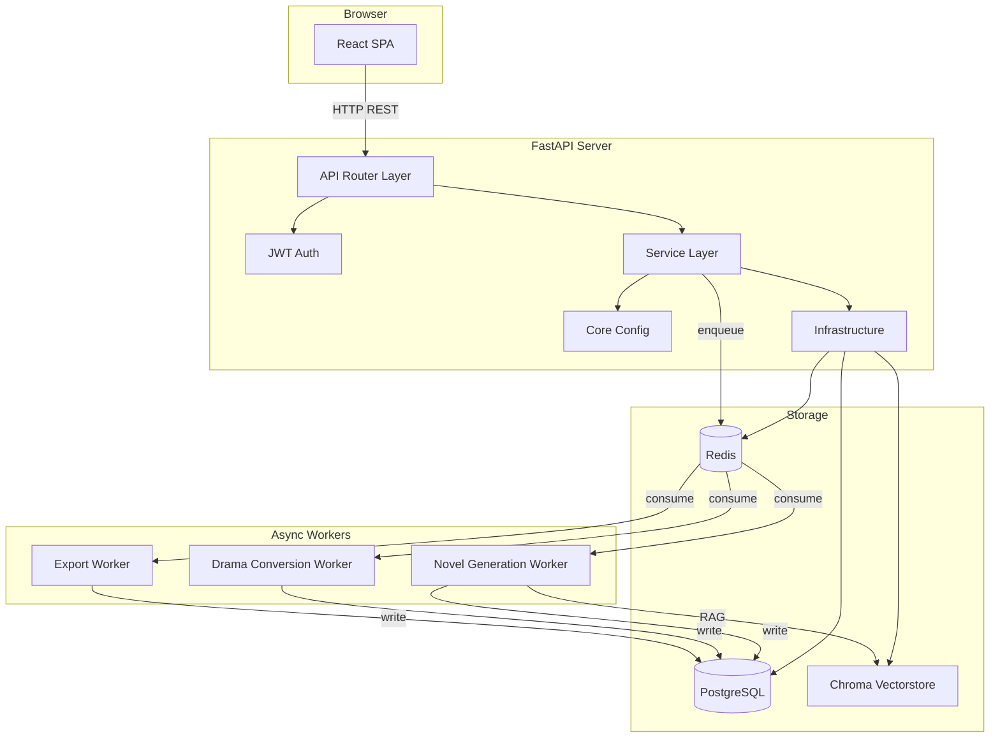

# 系统架构文档

## 1. 总体架构

采用前后端分离的 B/S 架构，后端为 FastAPI，前端为 React SPA，通过 REST API 通信。



---

## 2. 模块边界

### 2.1 后端分层

| 层级 | 职责 | 禁止事项 |
|------|------|---------|
| **core/** | 配置加载、常量定义、安全工具（密码哈希、JWT） | 不直接操作数据库或外部服务 |
| **infra/** | 数据库 Session、Redis 连接、Chroma 客户端封装、队列连接 | 不写业务逻辑 |
| **models/** | SQLAlchemy ORM 模型定义 | 不包含业务规则验证 |
| **schemas/** | Pydantic 请求/响应模型 | 不引用 SQLAlchemy 模型 |
| **routers/** | 接收请求、参数校验、调用 Service、返回响应 | 不写业务逻辑、不直接操作数据库 |
| **services/** | 业务逻辑实现、编排多个数据操作、调用外部服务 | 不写 HTTP 层逻辑 |
| **worker/** | 异步任务执行入口，调用 Service 完成长耗时操作 | 不直接暴露 HTTP 接口 |

### 2.2 前端分层

| 层级 | 职责 |
|------|------|
| **api/** | Axios 实例封装、API 请求函数、错误统一处理 |
| **components/** | 可复用 UI 组件，无业务状态 |
| **pages/** | 页面级组件，组合 components 和 hooks |
| **hooks/** | 自定义 React Hooks，封装数据获取和副作用 |
| **store/** | Zustand 全局状态（用户、当前项目、配置） |
| **types/** | TypeScript 类型定义，与后端 schemas 对应 |

---

## 3. 异步任务流转

### 3.1 为什么必须异步

LLM 调用（生成架构、目录、章节、短剧脚本）单请求耗时 30 秒到数分钟不等，HTTP 同步等待会导致：
- 客户端超时
- 服务端连接池耗尽
- 用户体验极差

### 3.2 任务流转模型

```
用户点击"生成架构"
  │
  ▼
Router 接收请求
  │
  ▼
Service 校验参数 → 创建 generation_tasks 记录（status=pending）
  │
  ▼
Service 将任务推入 Redis 队列
  │
  ▼
Router 返回 { task_id, status: "pending" }
  │
  ▼
Worker 从队列取出任务
  │
  ▼
Worker 更新 task 状态为 running，执行生成逻辑
  │
  ▼
生成完成 → 写入数据库（chapters / project_assets）
  │
  ▼
Worker 更新 task 状态为 completed / failed
  │
  ▼
用户轮询 GET /tasks/{task_id} 获取进度
```

### 3.3 任务状态机

```
pending → running → completed
              ↘ failed
```

MVP 阶段取消与重试通过 API 触发：
- `POST /tasks/{id}/cancel`：将 pending 任务标记为 cancelled
- `POST /tasks/{id}/retry`：将 failed 任务重新入队

### 3.4 队列选型

**已选择：Celery + Redis**

- Redis 已在基础设施中运行，复用为 Celery broker 和结果后端
- Celery 生态最成熟，支持任务重试、超时控制、监控（Flower）
- Worker 通过 `celery -A app.worker.tasks worker` 启动，与 FastAPI 进程分离

任务触发方式：
- Router 调用 `celery_task.delay(task_id)` 将任务推入 Redis 队列
- Celery Worker 从队列消费，通过 `asyncio.run()` 执行原有的 async 业务逻辑
- 崩溃恢复：`lifespan` 启动时扫描 `status='running'` 且超时（>30min）的任务，标记为 `failed`

---

## 4. 旧项目代码迁移方式

### 4.1 迁移原则

复用核心逻辑，改造运行形态。旧代码中的 prompt 模板、算法逻辑、adapter 工厂直接迁移；文件读写、CLI 入口、GUI 状态逻辑必须重写。

### 4.2 逐模块迁移清单

| 旧模块 | 来源项目 | 迁移目标 | 改造内容 |
|--------|---------|---------|---------|
| llm_adapters.py | AI_NovelGenerator | backend/app/services/llm/adapters.py | 保留工厂模式，配置来源改为数据库 api_configs 表 |
| embedding_adapters.py | AI_NovelGenerator | backend/app/services/embedding/adapters.py | 保留工厂模式，向量存储路径改为按 project_id 隔离 |
| novel_generator/architecture.py | AI_NovelGenerator | backend/app/services/novel/architecture.py | 输入从文件路径改为数据库查询，输出写入 project_assets |
| novel_generator/blueprint.py | AI_NovelGenerator | backend/app/services/novel/blueprint.py | 同上 |
| novel_generator/chapter.py | AI_NovelGenerator | backend/app/services/novel/chapter.py | 同上；RAG 上下文从向量库读取 |
| novel_generator/finalization.py | AI_NovelGenerator | backend/app/services/novel/finalization.py | 输出写入 chapters 表和 project_assets 表 |
| novel_generator/memory/memory_manager.py | AI_NovelGenerator | backend/app/services/novel/memory.py | JSON 文件读写改为操作 project_assets 表 |
| novel_generator/vectorstore_utils.py | AI_NovelGenerator | backend/app/infra/vectorstore.py | Chroma 路径改为 `{project_id}/vectorstore/` |
| prompts/ | AI_NovelGenerator | prompts/ | 直接复制，作为公共包供 services 引用 |
| scripts/data_loader.py | novel_to_drama | backend/app/services/drama/data_loader.py | 输入从文件系统改为数据库查询 |
| scripts/episode_mapper.py | novel_to_drama | backend/app/services/drama/episode_mapper.py | System Prompt 复用，调用改为 Service 接口 |
| scripts/script_generator.py | novel_to_drama | backend/app/services/drama/script_generator.py | 同上 |
| scripts/exporter.py | novel_to_drama | backend/app/services/drama/exporter.py | 输出从文件写入改为 API 响应（文件下载） |

### 4.3 不复用的内容

以下代码不迁移，在 Web 项目中重写：

- `main.py`（GUI 入口）→ 替换为 React 前端
- `run_cli.py`（CLI 入口）→ 替换为 FastAPI + Worker
- `ui/` 目录全部 → 替换为 React 组件
- `config_manager.py` 中的本地 JSON 文件读写逻辑 → 替换为数据库 CRUD
- `auto_generate.py` → 替换为 Service 编排 + 队列任务

---

## 5. 数据流向

### 5.1 小说生成流程

```
[Project] --创建--> [Architecture Task]
  │                     │
  │                     ▼
  │               [Worker] 调用 adapter + prompt
  │                     │
  │                     ▼
  │               [project_assets type=architecture]
  │                     │
  ▼                     ▼
[Directory Task] <--读取 architecture
  │
  ▼
[Worker] 生成目录
  │
  ▼
[project_assets type=directory]
  │
  ▼
[Chapter N Task] <--读取 architecture + directory + 前文
  │
  ▼
[Worker] 生成章节草稿
  │
  ▼
[chapters table] 写入 draft
  │
  ▼
[Finalize N Task]
  │
  ▼
[Worker] 更新 summary / character_state / vectorstore
  │
  ▼
[chapters table] 更新 finalized_text
[project_assets type=global_summary]
[project_assets type=character_state]
[Chroma] 新增章节向量
```

> P3-B 记忆闭环（章节生成路径）：写前组装「已冻结 arc 摘要 + 全书脉络（L3，仅伏笔提醒命中时）+ 伏笔/副线提醒 + known_by 信息约束」注入 `world_state_summary`；写后台账合并（无变化不写回）+ arc 边界冻结 + 全书结束合成 L3（批量结束 / 单章最后一章各一次）；全部失败安全且零新增每章 LLM 调用（L2/L3 摊薄 1/N）。

### 5.2 短剧改编流程

```
[Project] --选择--> [Drama Project]
  │
  ▼
[Plan Task] 读取小说 architecture / directory / chapters
  │
  ▼
[Worker] 生成改编计划
  │
  ▼
[project_assets type=adaptation_plan]
  │
  ▼
[Convert Task] 按 plan 逐集生成
  │
  ▼
[Worker] 调用 episode_mapper + script_generator
  │
  ▼
[drama_episodes] 写入 outline_json
[drama_scripts] 写入分镜头数据
  │
  ▼
[Export API] 按格式组装响应
```

---

## 6. 部署架构（MVP）

```
GitHub
  │
  ├── frontend/ ──► Vercel（自动构建部署）
  │
  └── backend/ ──► Railway / Render
         │            │
         │            ├── FastAPI Server
         │            ├── Worker Process
         │            ├── PostgreSQL（托管）
         │            └── Redis（托管）
         │
         └── Chroma 向量库（本地持久化存储）
```

### 6.1 环境变量

| 变量 | 用途 |
|------|------|
| DATABASE_URL | PostgreSQL 连接 |
| REDIS_URL | Redis 连接 |
| JWT_SECRET | JWT 签名密钥 |
| CHROMA_PERSIST_DIR | Chroma 持久化目录 |
| ARC_SIZE | arc 章节数（每 N 章冻结一次 arc 摘要，摊薄 1/N；默认 15） |

---

## 7. 安全边界

- 用户密码使用 bcrypt 哈希存储
- JWT Token 过期时间 24 小时
- API Key（LLM 配置）加密存储，不在日志中明文输出
- 项目数据按 owner_id 隔离，未授权用户无法访问他人项目
- CORS 配置限制为前端域名

---

## 8. Phase 1 架构范围

### 包含

- FastAPI + SQLAlchemy + Alembic 基础框架
- PostgreSQL 单数据库实例
- Redis 任务队列
- 单 Worker 进程（本地开发）
- Chroma 向量库本地文件存储
- JWT 认证
- REST API（无 WebSocket）
- 任务状态轮询（GET /tasks/{id}）

### 不包含

- 多 Worker 分布式部署
- WebSocket 实时推送
- 向量库云服务（Pinecone/Qdrant）
- 负载均衡 / 反向代理配置（由部署平台处理）
- 对象存储（S3/OSS）
- 缓存层（Redis 仅用于队列）
